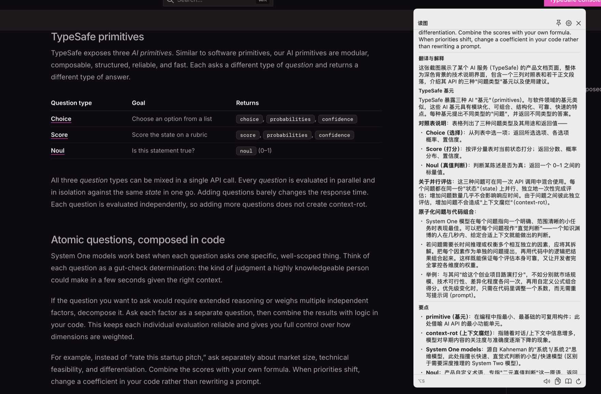
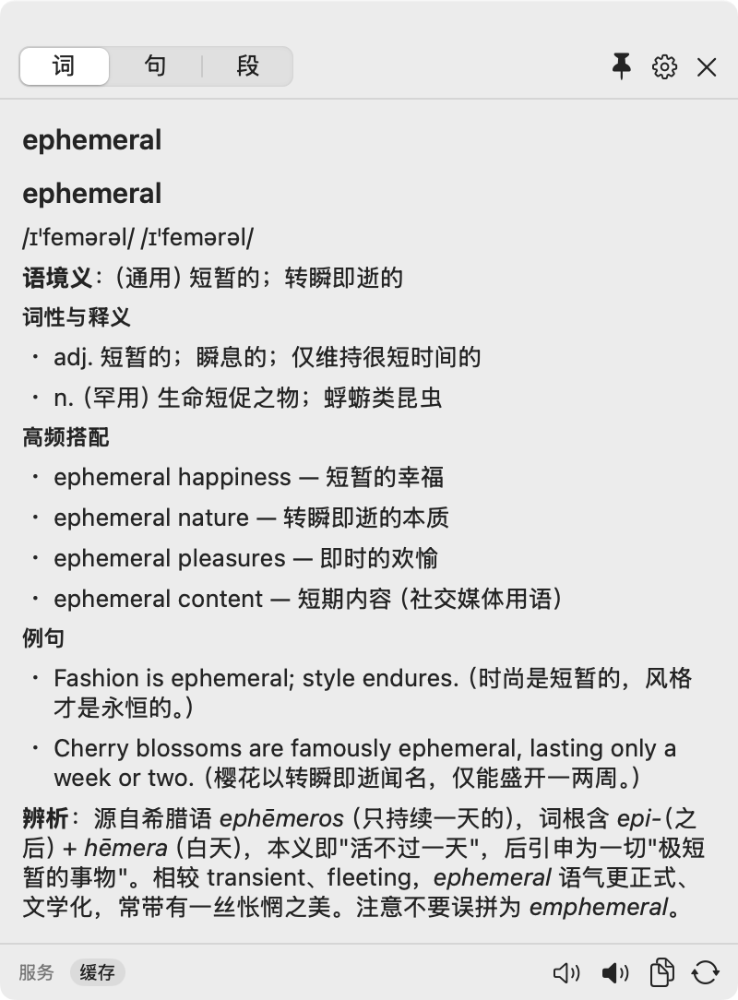

# Gloss · Lookup as you read

English | [简体中文](README.md)

**System-level English reading assistant for macOS**: select to look up, capture to ask, deep-read long articles — powered by your own LLM API key (MiniMax M3 by default, any OpenAI-compatible endpoint supported).

<p align="center">
  
  <br>
  
</p>

## Why

Reading English documents today means switching to a dictionary site for unknown words, copy-pasting tricky sentences into a chatbot, and photographing on-screen text for a multimodal model — each 5+ steps that break your reading flow. Gloss collapses all of it into **one action**: select and press ⌥D, or frame a screen region with ⌥S.

## Features

- **⌥D Select & lookup**: a non-focus-stealing popup appears next to your selection, auto-routed by content:
  - **Word card**: US/UK IPA, **context-aware meaning**, collocations, bilingual examples, etymology
  - **Sentence card**: faithful translation + clause-by-clause structure breakdown + difficult words (click any chip to keep drilling)
  - **Paragraph card**: translation + key vocabulary table
- **⌥S Capture & ask**: frame any screen region (images, charts, video frames, non-selectable UI) and send it straight to a multimodal model; **click a word on the thumbnail** to look it up
- **Long-form deep read**: selecting ≥400 words opens the reader window — batched full translation, vocabulary table (IPA / sense / original example), terminology table, and argument-structure analysis
- **Speech**: offline system TTS with US/UK voices for words, sentences, and recognized text
- **Vocabulary trail**: query history with replay; response cache (repeated lookups are instant and free)
- **Multi-config**: switch between model profiles; works with any OpenAI-compatible endpoint (MiniMax / OpenAI / DeepSeek / Zhipu / Kimi / local Ollama…)

## Download

Grab the latest `Gloss-vX.Y.Z.zip` from [Releases](../../releases) and unzip to get `Gloss.app`.

**Auto-updates**: since v0.1.3 the app checks for updates via [Sparkle](https://sparkle-project.org) (update packages verified with an EdDSA signature). Two entry points: the menu bar icon → 「检查更新…」(Check for Updates), and Settings → 高级 → 「检查更新…」 (the Advanced tab also shows the current version, last check time, and an auto-check toggle; available since v0.1.4). On the second launch it asks whether to allow periodic background checks — once allowed, new versions pop a release-notes dialog with an in-app download + install + relaunch, no manual download needed.

> v0.1.2 and earlier have no built-in updater — download v0.1.3 manually once, and auto-updates take it from there.

> **First launch**: the app is signed with an Apple Development certificate (not Apple notarized), so macOS blocks the first launch. Unblock with either:
> - **System Settings → Privacy & Security**, find the notice about Gloss, click **"Open Anyway"** (recommended on macOS 15+);
> - or run in Terminal:
> ```bash
> xattr -cr /path/to/Gloss.app
> ```
>
> On macOS 14, right-click the app → Open also works.

**Requires**: macOS 14 (Sonoma) or later, Apple Silicon.

## Quick start

1. Launch Gloss (lives in the menu bar, no Dock icon) and follow the onboarding wizard
2. On the model page pick the **MiniMax** preset, paste your [MiniMax API key](https://platform.minimaxi.com), and hit "Test connection"
   - Or pick another preset / "Custom" and fill in any OpenAI-compatible base URL, path, and model name
3. Done. Select any English text anywhere and press **⌥D**

### Three trigger channels

| Channel | How | Permission |
|---|---|---|
| Services menu | Select text → right-click → Services → "Gloss 查词" | none |
| Selection hotkey | Select text → **⌥D** | Accessibility |
| Capture hotkey | **⌥S** → frame a screen region | Screen Recording |

> ⚠️ **Can't find "Gloss 查词" in the Services menu?** macOS disables newly installed third-party services by default. Enable it once under System Settings → Keyboard → Keyboard Shortcuts → Services → Text.
>
> ⌥D / ⌥S trigger a system permission prompt on first use. If you re-installed the app and permissions stopped working, toggle the corresponding switch off and on under System Settings → Privacy & Security.

## Privacy

- Your API key lives only in the macOS Keychain — never logged, cached, or stored in plaintext anywhere
- Query content is sent only to the model provider you configure
- No telemetry, no crash reporting, no third-party data collection

## Building from source

```bash
git clone https://github.com/<you>/gloss.git
cd gloss
open Gloss.xcodeproj   # Xcode 16+, just Cmd+R
```

- System frameworks first (AppKit / SwiftUI / SwiftData / PDFKit / AVFoundation / Carbon); the only third-party dependency is [Sparkle](https://github.com/sparkle-project/Sparkle) 2.10+ (update framework, pulled via SPM)
- Logic self-check: compile `SelfCheck/main.swift` together with the core logic files and run it (65 assertions across routing / SSE / section extraction / cache keys / image pipeline)
- Signing: Xcode automatic signing or any local self-signed certificate works; no feature depends on a specific identity. **Note**: the auto-update chain is anchored to the publisher's EdDSA key pair — self-compiled builds will happily accept official updates and overwrite local artifacts, so ignore in-app prompts or install manually from Releases as you prefer; the update chain only breaks if the publisher replaces or loses the EdDSA private key
- Packaging & release: `scripts/release.sh` builds the Release binary and produces the local install bundle, the distributable zip, and the Sparkle appcast (`dist/appcast.xml`, EdDSA-signed via `sign_update`, markdown markers stripped for the update dialog) in one shot; append `--publish` to create a GitHub Release and upload the zip + appcast, after which installed apps pick up the update
- Release flow: the single source of truth for versioning is pbxproj's `MARKETING_VERSION` + `CURRENT_PROJECT_VERSION` (injected into Info.plist via `$(VAR)`) — bump **both**, then run `--publish`. The script gates publishing three ways: working tree must be clean and pushed, the build number must exceed the published latest, and re-publishing an existing tag is refused
- Update signing key: the EdDSA private key generated by `generate_keys` lives in your login keychain — **keep an offline backup** (`generate_keys -x <file>`); losing it means you can no longer push auto-updates to existing users

## Technical notes

- **Text capture**: Accessibility API first (including selection bounds and surrounding context), simulated ⌘C clipboard fallback, automatic degradation between the two
- **SSE streaming**: byte-level line splitting that preserves blank lines (`URLSession.bytes.lines` silently drops SSE event delimiters — found the hard way), supports both `reasoning_content` and inline `<think>` reasoning shapes, exponential-backoff retry on 429/5xx
- **Multimodal**: screenshots are downscaled to ≤1568px JPEG and sent as `image_url` data URLs
- **Cache**: key = sha256(normalized input | kind | params | model | prompt version), LRU + SwiftData persistence; word-at-point coordinates are quantized to a 1% grid and folded into the key
- **Popup**: nonactivating NSPanel that never steals keyboard focus, works in fullscreen and across displays; ESC is a consuming global hotkey installed only while the panel is visible
- **Auto-updates**: Sparkle 2 + a static GitHub Releases appcast (`releases/latest/download/appcast.xml`, which GitHub 302s to the newest release asset — **no self-hosted backend**); update packages are EdDSA-verified (public key in Info.plist, private key in the publisher's keychain); the menu bar and the settings page share a single updater instance (`UpdaterCenter`)

## Docs

- [DESIGN.md](docs/DESIGN.md) — decision log and document index
- [product-design.md](docs/product-design.md) — product & interaction design (scenarios / card specs / state tables)
- [tech-design.md](docs/tech-design.md) — technical design (architecture / data flow / full prompts / task breakdown)
- [reviews/](docs/reviews/) — complete records of the three-stage independent review process

## License

[MIT](LICENSE)
